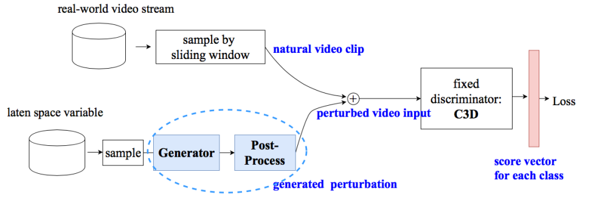

# C-DUP — Circular Dual-Purpose Universal Perturbation

Reproduction of **Li et al., "Stealthy Adversarial Perturbations Against Real-Time Video
Classification Systems," NDSS 2019.**

---

## 1. Core idea



> Figure: Li et al., NDSS 2019

**Produce a single 16-frame perturbation that works wherever the classifier cuts the clip.**

A **generator** takes a latent variable `z` and produces the perturbation, and a post-process
bounds its magnitude with `p = ξ·tanh(·)`. Because `tanh` outputs lie in `[-1,1]`,
`‖p‖∞ ≤ ξ` is **guaranteed by construction** and no projection step is needed. The
perturbation is added to a clip cut from the real-time stream by a sliding window, and the sum
is fed to a **frozen C3D**. The loss pushes down the true-class probability, and
backpropagation updates the generator weights only.


## 2. Method

### 2.1 Architecture

```
z ~ U[-1,1]^100
  │
  ├─ Generator (five 3D transposed convolutions)
  │    100 → 1×7×7 (512) → 2×14×14 (256) → 4×28×28 (128) → 8×56×56 (64) → 16×112×112 (3)
  │    BatchNorm + ReLU on the first four layers, tanh on the last
  │
  ├─ p = ξ · tanh(·),  ξ = 10          
  │
  ├─ Roll(p, o),  o ∈ {0 … 15}         
  │
  ├─ x + Roll(p, o)
  │
  └─ Frozen discriminator = pretrained C3D (weights never updated)
         ↓
       loss  →  gradients update the generator only
```

### 2.2 Objective (paper Eq. 3)

```
min_G  Σ_{o=1..w} {  λ · Σ_{x∈T} −log[ 1 − Q(x + Roll(G(z), o)) ]     (break the target set T)
                         + Σ_{x∈S} −log[     Q(x + Roll(G(z), o)) ] }  (preserve the rest, S)
```

`Q(·)` is the softmax score C3D assigns to the ground-truth class. The outer **sum over every
cyclic shift `o`** is the essential part: the perturbation is not fitted to one alignment but
optimized **across the full range of temporal shifts it will actually encounter**.

---

## 3. Usage

```bash
export DF_ROOT=/path/to/uap-baselines      # optional; defaults to the repository root
cd $DF_ROOT

PYTHONPATH=common python adapters/cdup_adapter.py --tier 1
```

**The run is resumable.** If `results/cdup/generator.pt` exists it is reused instead of
retraining. Pass `--force_train` to retrain from scratch.

| Flag | Default | Meaning |
|---|---|---|
| `--tier` | `1` | 1 = 101 videos (one per class), 3 = 303 videos |
| `--eps` | `10` | L∞ budget; equals the authors' `p_max` |
| `--epochs` | `3` | the authors' `train_epoch` |
| `--batch` | `64` | |
| `--seed` | `0` | random seed for extracting the perturbation |
| `--force_train` | off | ignore the checkpoint and retrain |
| `--name` | `cdup` | output directory; change it for ablations |

Changing `--eps` appends a suffix to the checkpoint and UAP filenames, so earlier results are
never overwritten.

> **Perturbation reproducibility.** The UAP is a single sample drawn from the trained
> generator. It is drawn with a dedicated `torch.Generator(--seed)`, and only that step runs
> in cuDNN deterministic mode, so the same `generator.pt` and `--seed` always yield the same
> `.npy`. Generator training itself uses non-deterministic backward kernels, however, so a
> retrained `generator.pt` is not bit-for-bit reproducible.

### Outputs

| Path | Contents |
|---|---|
| `results/cdup/generator.pt` | trained generator weights |
| `results/cdup/cdup_perturbation.npy` | UAP, `(3, 16, 112, 112)` float32 |
| `results/cdup/train_log.json` | step count, loss curve, wall time |
| `results/cdup/records.jsonl` | one line per evaluated video |
| `results/cdup/summary.json` | aggregate metrics for the run |

Reusing the perturbation requires nothing but the `.npy`:

```python
import numpy as np, torch
delta = torch.from_numpy(np.load("results/cdup/cdup_perturbation.npy"))   # (3,16,112,112)
adv = (clip + delta).clamp(0, 255)                                        # clip: (3,16,112,112), 0-255
```

---

## 6. Citation

```bibtex
@inproceedings{li2019stealthy,
  title     = {Stealthy Adversarial Perturbations Against Real-Time Video Classification Systems},
  author    = {Li, Shasha and Neupane, Ajaya and Paul, Sujoy and Song, Chengyu and
               Krishnamurthy, Srikanth V. and Roy Chowdhury, Amit K. and Swami, Ananthram},
  booktitle = {Network and Distributed System Security Symposium (NDSS)},
  year      = {2019}
}
```
