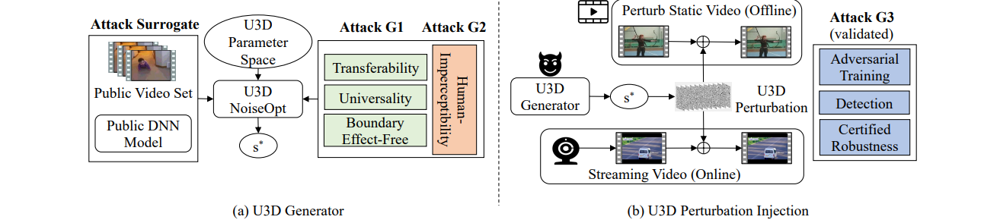

# U3D — Universal 3-Dimensional Perturbations

Reproduction of **Xie et al., "Universal 3-Dimensional Perturbations for Black-Box Attacks on
Video Recognition Systems," IEEE S&P 2022.**

## 1. Core idea



> Figure: Xie et al., IEEE S&P 2022

**The perturbation is not stored. It is described by a formula.**

No neural network is trained. Procedural noise from computer graphics (Perlin) is extended to
three dimensions, so that the entire perturbation is defined by five parameters:

```
S = { λx, λy, λt, Λ, φ }
```

The attacker searches this five-dimensional space with PSO on a **surrogate model and a public
video set** (figure a). The objective maximizes the distance between intermediate features and
**never reads the classification output** — which is precisely what lets a single expression
target transferability, universality and boundary-effect freedom at once.

The search leaves a single `s*`. Once the noise has been synthesized from it, injection is **one
tensor addition** — the same whether it is applied offline to a stored video or online to a
live stream (figure b).

### Three properties that follow

- **Near-zero transmission and storage cost.** The parameters alone regenerate the
  perturbation on the spot, at any resolution and length.
- **Temporal consistency.** The noise is a continuous function of time, so it changes smoothly
  between frames instead of flickering.
- **Inter-frame coherence is preserved.** Because the noise is not drawn independently per
  frame, it does not break the inter-frame consistency that optical-flow based detectors such
  as AdvIT rely on.

This is the structural contrast with C-DUP, which emits each frame of the perturbation
independently.

---

## 2. Method

### 2.1 Perturbation (paper Eq. 1–2)

```
             Λ
N(x, y, t) =  Σ   p( x·2^ℓ/λx ,  y·2^ℓ/λy ,  t·2^ℓ/λt )                (Eq. 1)
            ℓ=0

N_p(x, y, t) = cmap( N, φ ) = sin( N · 2πφ )                            (Eq. 2)
```

| Symbol | Role |
|---|---|
| `p(·)` | 3D Perlin lattice gradient noise |
| `λx, λy, λt` | wavelength per axis. **`λt` sets how fast the noise changes between frames** |
| `Λ` | number of octaves; superimposes scales to build texture detail |
| `φ` | period of the sine color map. Being a sine, the output is bounded and circular |

### 2.2 Objective (paper Eq. 12)

```
max_ξ   E_{v∼V,  τ∼U[0,T−1]} [  Σ_{d∈M}  D( v,  v + Trans(ξ, τ);  d ) ]

  s.t.  ξ = N(T; S),    ‖ξ‖∞ ≤ ε
```

| Term | Goal |
|---|---|
| `Σ_{d∈M} D(·; d)` | **Transferability** — maximize the distance between *intermediate* features, not logits |
| `E_{τ∼U[0,T−1]} Trans(ξ, τ)` | **Boundary-effect freedom** — expectation over every temporal offset |
| `E_{v∼V}` | **Universality** — expectation over a public video set |
| `ξ = N(T; S)` | The optimization variable is **five parameters**, not a 602,112-element tensor |

`D` is an L2 distance taken after power normalization with α = 0.5.

> **The objective never reads the classifier's output.** In the reference implementation:
>
> ```python
> # repos/u3d/python/u3d-attack-C3D.py
> def intermediate_features(model, inputs):
>     logits, intermediate_dict = model.forward(inputs)
>     return intermediate_dict          # logits are discarded
> ```
>
> Consequently the objective and the search loop can be retargeted at **any** model that
> exposes intermediate activations — even a non-classifier — by replacing the wrapper alone.
> No labels are required either.

### 2.3 Search

The parameter space is five-dimensional and non-convex, so gradient-based methods do not apply.
Particle Swarm Optimization (PSO) is used instead. The paper benchmarks PSO against genetic
algorithms, simulated annealing and Tabu search, and reports it as both the fastest and the best.

---

## 3. Usage

```bash
export DF_ROOT=/path/to/uap-baselines      # optional; defaults to the repository root
cd $DF_ROOT

# Repository defaults
PYTHONPATH=common python adapters/u3d_adapter.py --tier 1

# Full 40-generation PSO search (§4.2)
PYTHONPATH=common python adapters/u3d_adapter.py --tier 1 \
    --minstep 0 --minfunc 0 --name u3d_longsearch

# Corrected to the paper's Eq. 1 / Eq. 2 (§4.1)
PYTHONPATH=common python adapters/u3d_adapter.py --tier 1 \
    --paper_cmap True --name u3d_paper

# Improved setting: U3D-N
PYTHONPATH=common python adapters/u3d_adapter.py --tier 1 \
    --noise nyquist --fitness score --omega -0.27 --restarts 3 --name u3d_nyquist
```

**The run is resumable.** If `results/<name>/u3d_params.json` exists, the search is skipped. Pass
`--force_optimise` to search again. The cache also records the noise, fitness, search bounds and
number of restarts; running a different configuration under the same `--name` stops with an
error instead of reusing the old parameters.

> The Rust extensions must be built first — see [`scripts/setup_u3d.sh`](../scripts/setup_u3d.sh).
> Without them the adapter fails with `ModuleNotFoundError: No module named 'perlin'`.

### Outputs

| Path | Contents |
|---|---|
| `results/<name>/u3d_params.json` | searched parameters (six, including β, for nyquist), configuration, search log |
| `results/<name>/u3d_perturbation.npy` | UAP, `(16, 112, 112)` |
| `results/<name>/records.jsonl` | one line per evaluated video |
| `results/<name>/summary.json` | aggregate metrics for the run |

The perturbation has no channel axis. The same value is added to all three channels, matching
the upstream `add_perlin_noise_to_frame`:

```python
import numpy as np, torch
noise = torch.from_numpy(np.load("results/u3d/u3d_perturbation.npy")).float()   # (16,112,112)
adv = (clip + noise.unsqueeze(0)).clamp(0, 255)                         # clip: (3,16,112,112), 0-255
```

---

## 4. Citation

```bibtex
@inproceedings{xie2022universal,
  title     = {Universal 3-Dimensional Perturbations for Black-Box Attacks on
               Video Recognition Systems},
  author    = {Xie, Shangyu and Wang, Han and Kong, Yu and Hong, Yuan},
  booktitle = {IEEE Symposium on Security and Privacy (S\&P)},
  pages     = {1390--1407},
  year      = {2022}
}
```
